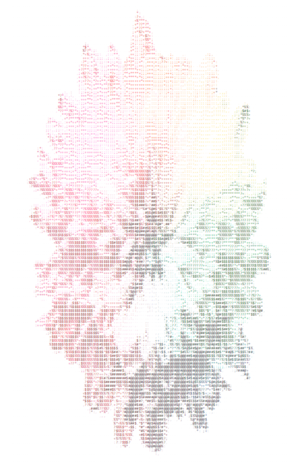

# image-to-colored-ascii-code
This program converts image file to ascii code texts such as .txt, .rtf, .docs, .html

# how to run this program
do `python run.py -h` in terminal to get help about running run.py

# Image Reference
- Sample Image 0: sample-image-0.jpg by [Sharon Pittaway](https://unsplash.com/photos/iMdsjoiftZo?utm_source=unsplash&utm_medium=referral&utm_content=creditShareLink)
- Sample Image 1: sample-image-1.png in [site](https://www.pngkey.com/maxpic/u2t4y3q8q8q8u2a9/)

# Source Code Reference
- [python pillow](https://pillow.readthedocs.io/en/stable/reference/Image.html)
- [python pillow resampling filters](https://pillow.readthedocs.io/en/stable/handbook/concepts.html#concept-filters)
- [RTF simple tutorial](http://www.pindari.com/rtf1.html)
- [youtube Easy Python PIL Tutorial](https://www.youtube.com/watch?v=v_raWlX7tZY&ab_channel=Kite)
- [how to use python setup(Korean)](https://www.flowdas.com/blog/%ED%8C%8C%EC%9D%B4%EC%8D%AC-%ED%94%84%EB%A1%9C%EC%A0%9D%ED%8A%B8-%EC%8B%9C%EC%9E%91%ED%95%98%EA%B8%B0-setuptools/)
- [python-docx documentation](https://python-docx.readthedocs.io/en/latest/)
- [RTF Version 1.5 Specification](https://www.biblioscape.com/rtf15_spec.htm)

# get output file with cli
- sample-image-0.txt: `python run.py input/sample-image-0.jpg -s 0.04 -d output/sample-image-0 -f txt`
- sample-image-0.rtf: `python run.py input/sample-image-0.jpg -s 0.08 -d output/sample-image-0 -f rtf -p 8 -rs LANCZOS -fs 2`
- sample-image-1.txt: `python run.py input/sample-image-1.png -s 0.04 -d output/sample-image-1 -f txt`
- sample-image-1.rtf: `python run.py input/sample-image-1.png -s 0.08 -d output/sample-image-1 -f rtf -p 8 -rs LANCZOS -fs 2`
